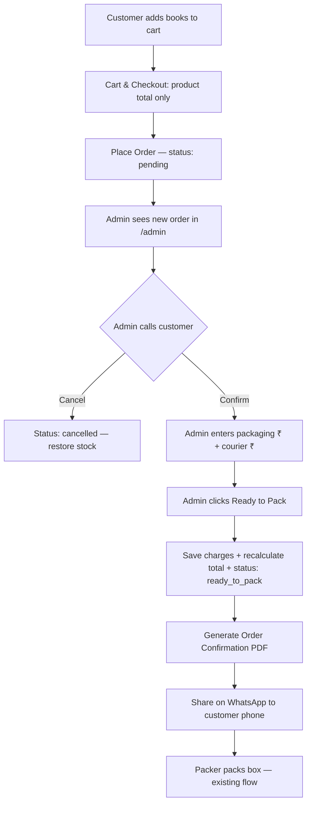

# Plan: Call-Confirmed Packaging & Courier Charges

> **Goal:** Customers pay only for books/kitabs/Quran on the website. Packaging and courier charges are discussed on a phone call, entered by admin, and shared via a PDF on WhatsApp when the order is confirmed for packing.

**Status:** Planning document — not yet implemented  
**Last updated:** July 9, 2026

---

## 1. What You Want (Summary)

| Area | Today (current code) | What you want |
| :--- | :--- | :--- |
| **Checkout total** | Product price + auto shipping (₹30–50/kg courier or ₹50 post) | **Product price only** (with existing Quran & bulk discounts) |
| **Shipping notice** | Shows calculated shipping in cart | **Bilingual note (EN + UR):** charges will be told on phone after order |
| **Admin confirm** | "Ready to Pack" → call modal → send to packer | **Confirm order** on call, **add courier + packaging ₹**, then **Ready to Pack** |
| **Admin cancel** | Not available | **Cancel order** button with confirmation |
| **PDF** | "Download Bill" on admin (uses checkout-time charges) | **Auto-generate on Ready to Pack** with product + packaging + courier + total + status |
| **WhatsApp** | Not available | **Share PDF / summary** to customer's phone from order |

---

## 2. End-to-End Workflow (Target)



### Step-by-step (plain language)

1. **Customer** browses, adds books, goes to checkout. They see **only book charges** (minus Quran ₹25/copy and bulk 10%/15% discounts if applicable). No packaging or courier line in the total.
2. Below the total, they see a **notice in English and Urdu** explaining that packaging and courier costs will be confirmed by phone call after the order is placed.
3. Customer places order → stored as `pending`. Stock is deducted (same as today).
4. **Admin** opens `/admin` → Orders tab, sees the pending order.
5. Admin **calls** the customer (existing call modal — keep this).
6. On the call, admin discusses packaging (e.g. ₹200) and courier (e.g. ₹500). Customer agrees to pay these **on the call** (UPI/cash as you already do).
7. Admin enters those amounts in the confirmation modal and clicks **Confirm & Ready to Pack**.
8. System saves charges, updates `total`, sets status to `ready_to_pack`, generates a **PDF**, and offers **Share on WhatsApp**.
9. If the customer cancels or order is invalid, admin clicks **Cancel Order** → status `cancelled`, stock restored.

---

## 3. Customer-Facing Changes

### 3.1 Remove auto shipping from checkout total

**Files to change:**

| File | Change |
| :--- | :--- |
| `context/CartContext.tsx` | Set `packagingCharge` to **always `0`** for checkout total (or add a flag `chargesDeferred: true`). Keep pincode/delivery type for admin reference only. |
| `lib/shipping.ts` | Keep file for **admin-side estimate helper** (optional), but stop using it in customer total. |
| `components/cart/OrderSummary.tsx` | Remove shipping amount from total breakdown. Replace with bilingual notice. |
| `app/checkout/page.tsx` | Save `packaging_charge: 0`, `courier_charge: 0` at order creation. `total = subtotal - discount`. |

### 3.2 Bilingual notice (English + Urdu)

Add new keys in `context/LanguageContext.tsx`:

**English (`shippingCallNotice`):**
> Packaging and courier charges are **not included** in this total. After you place your order, we will call you to confirm your address and tell you the packaging and delivery charges. You will pay those charges during the phone call before we pack your order.

**Urdu (`shippingCallNoticeUr`):**
> پیکجنگ اور کورئیر چارجز اس رقم میں شامل نہیں ہیں۔ آرڈر دینے کے بعد ہم آپ کو فون کر کے پتہ تصدیق کریں گے اور پیکجنگ و ڈیلیوری چارجز بتائیں گے۔ پیکنگ سے پہلے فون پر ان چارجز کی ادائیگی ہوگی۔

**Where to show:**
- Cart `OrderSummary` — below total (highlighted info box, blue/amber style like existing discount banner)
- Checkout page — same notice above "Place Order" button
- Order success screen — short reminder

### 3.3 Keep delivery method & pincode (for admin)

Do **not** remove Courier / Post / In Person selection or pincode field. Admin still needs:
- How customer wants delivery
- Pincode / state for estimating courier on the call

Just don't add those charges to the website total.

### 3.4 In-person pickup

For `in_person` delivery, the notice can say packaging/courier is ₹0 (or N/A). Admin can still confirm with one click.

---

## 4. Database Changes

### 4.1 New / updated columns on `orders`

```sql
-- Migration: lib/migrations/add-call-confirmed-charges.sql

ALTER TABLE orders
  ADD COLUMN IF NOT EXISTS courier_charge NUMERIC(10,2) NOT NULL DEFAULT 0,
  ADD COLUMN IF NOT EXISTS admin_notes TEXT,
  ADD COLUMN IF NOT EXISTS confirmed_at TIMESTAMPTZ,
  ADD COLUMN IF NOT EXISTS cancelled_at TIMESTAMPTZ,
  ADD COLUMN IF NOT EXISTS cancel_reason TEXT;

-- packaging_charge already exists — use it ONLY for admin-entered packaging (not auto shipping)
-- total will be recalculated when admin confirms:
-- total = subtotal - discount + packaging_charge + courier_charge
```

### 4.2 Order status values

| Status | Meaning |
| :--- | :--- |
| `pending` | New order — waiting for admin call |
| `ready_to_pack` | Confirmed on call, charges added, sent to packer |
| `packed` | Box packed (existing) |
| `cancelled` | **NEW** — order cancelled, stock restored |

Update `lib/supabase.ts` → `updateOrderStatus` to accept `"cancelled"`.

### 4.3 TypeScript types

Update `Order` interface in `lib/supabase.ts` and `app/admin/page.tsx`:

```ts
interface Order {
  // ...existing fields...
  packaging_charge: number;  // admin-entered packaging (was auto shipping)
  courier_charge: number;    // NEW — admin-entered courier
  admin_notes?: string;
  confirmed_at?: string;
  cancelled_at?: string;
  cancel_reason?: string;
  status: "pending" | "ready_to_pack" | "packed" | "cancelled";
}
```

### 4.4 Stock on cancel

When status → `cancelled`, **restore stock** for each `order_item` (reverse of `insertOrder` deduction). Add `db.cancelOrder(id, reason?)` in `lib/supabase.ts`.

---

## 5. Admin Panel Changes

### 5.1 Pending order card — new actions

Each `pending` order currently has **Ready to Pack** and **Download Bill**. Change to:

| Button | Action |
| :--- | :--- |
| **Confirm Order** (primary) | Opens enhanced call-confirmation modal (see 5.2) |
| **Cancel Order** (destructive) | Opens cancel modal with optional reason → `cancelled` + stock restore |
| ~~Download Bill~~ | Hide for `pending` orders (bill not final until charges added) |

### 5.2 Enhanced call-confirmation modal

Extend the existing modal in `app/admin/page.tsx` (lines ~1162–1270):

**New fields inside modal:**

```
┌─────────────────────────────────────────────┐
│  Confirm Order — Call Customer              │
├─────────────────────────────────────────────┤
│  Order NM-123456 · Raju · 9876543210        │
│  [Call] tel: link (existing)                │
│                                             │
│  Products total (after discount):  ₹4,500   │
│                                             │
│  Packaging charge (₹):  [  200  ]           │
│  Courier charge (₹):    [  500  ]           │
│  ─────────────────────────────────          │
│  Final total:           ₹5,200              │
│                                             │
│  Admin notes (optional): [____________]     │
│                                             │
│  [Cancel]  [Confirm & Ready to Pack]        │
└─────────────────────────────────────────────┘
```

**On "Confirm & Ready to Pack":**
1. Validate charges ≥ 0 (allow 0 for in-person)
2. `total = subtotal - discount + packaging_charge + courier_charge`
3. Update order in DB: charges, total, `status: ready_to_pack`, `confirmed_at: now()`
4. Generate PDF (section 6)
5. Show success toast + **Share on WhatsApp** button

### 5.3 Cancel order modal

```
┌─────────────────────────────────────────────┐
│  Cancel Order NM-123456?                    │
│  This will restore stock and cannot be      │
│  undone easily.                             │
│  Reason (optional): [________________]      │
│  [Go Back]  [Cancel Order]                  │
└─────────────────────────────────────────────┘
```

### 5.4 Ready-to-pack orders

Keep existing "With Packer" list. Add:
- Show packaging + courier breakdown on the card
- **Download Confirmation PDF** (re-download anytime)
- **Share on WhatsApp** again if needed

### 5.5 Dashboard / revenue

Revenue calculations should **exclude `cancelled`** orders (and optionally exclude `pending` until confirmed — same as today).

---

## 6. PDF — Order Confirmation Document

### 6.1 New component (recommended)

Create `components/pdf/OrderConfirmationDocument.tsx` (or extend `InvoiceDocument.tsx`).

**PDF contents:**

| Section | Content |
| :--- | :--- |
| Header | Noorani Makatib logo, Order ID, date |
| Customer | Name, phone, address, delivery type |
| Line items | Book name × qty × price = line total |
| Subtotal | Sum of items |
| Discounts | Quran ₹25/copy, 10%/15% if applicable |
| **Packaging charges** | Admin-entered `packaging_charge` |
| **Courier charges** | Admin-entered `courier_charge` |
| **Grand total** | Final `total` |
| Status | **"Ready to Pack"** or **"Order Under Processing"** (your choice — recommend "Ready to Pack" once confirmed) |
| Footer | Bilingual thank-you + contact |

Bilingual labels in PDF (optional but nice):
- Packaging: `Packaging / پیکجنگ`
- Courier: `Courier / کورئیر`
- Total: `Total / کل رقم`

### 6.2 When to generate

| Trigger | PDF |
| :--- | :--- |
| Admin clicks **Confirm & Ready to Pack** | Auto-download + offer WhatsApp share |
| Admin clicks **Download Confirmation** on ready_to_pack order | Re-download same PDF |

Use existing `lib/pdf-download.tsx` pattern (`downloadPdf`, `@react-pdf/renderer`).

### 6.3 New type

```ts
// lib/order-confirmation.ts
export interface OrderConfirmationData extends InvoiceData {
  courier_charge: number;
  status: string;
  statusLabel: string; // "Ready to Pack" | "Under Processing"
}
```

---

## 7. WhatsApp Share

### 7.1 Approach (no WhatsApp Business API needed)

Use the **WhatsApp click-to-chat URL** — works on mobile and desktop:

```
https://wa.me/91{phone}?text={encodedMessage}
```

- Strip non-digits from `customer_phone`, prepend `91` if 10-digit Indian number
- Message includes order summary + note that PDF is attached/sent

### 7.2 Share flow

**Option A — Text + manual PDF attach (simplest, recommended for v1):**
1. Generate PDF blob → auto-download to admin's device
2. Open WhatsApp with pre-filled text:
   > Assalamualaikum {name}, your order {orderId} is confirmed. Product: ₹X, Packaging: ₹Y, Courier: ₹Z, Total: ₹T. Please find the confirmation PDF attached.
3. Admin manually attaches the downloaded PDF in WhatsApp (one extra tap)

**Option B — Web Share API (mobile only):**
```ts
if (navigator.share && navigator.canShare({ files: [pdfFile] })) {
  await navigator.share({ files: [pdfFile], text: message });
}
```
Falls back to Option A on desktop.

### 7.3 Helper function

Add `lib/whatsapp.ts`:

```ts
export function buildWhatsAppUrl(phone: string, message: string): string;
export function formatOrderWhatsAppMessage(order: OrderConfirmationData): string;
```

Button in admin modal: **Share on WhatsApp** → green button with WhatsApp icon.

---

## 8. Implementation Phases

### Phase 1 — Checkout: product-only total (1–2 days)

- [ ] `CartContext`: checkout total excludes shipping
- [ ] `OrderSummary` + checkout: bilingual notice, remove shipping line from total
- [ ] `LanguageContext`: new translation keys
- [ ] `checkout/page.tsx`: save `packaging_charge: 0`, `courier_charge: 0`
- [ ] Keep pincode + delivery type for admin info

**Test:** Place order → total = books only; notice visible in EN and UR.

### Phase 2 — Database & types (0.5 day)

- [ ] SQL migration: `courier_charge`, `confirmed_at`, `cancelled_at`, `cancel_reason`
- [ ] Update `Order` type in `lib/supabase.ts`, admin page, invoice types
- [ ] `db.updateOrderCharges(id, { packaging, courier, total, notes })`
- [ ] `db.cancelOrder(id, reason?)` with stock restore

**Test:** Migration runs on Supabase; mock DB fallback updated.

### Phase 3 — Admin confirm + cancel (1–2 days)

- [ ] Enhanced call modal with charge inputs + live total preview
- [ ] Rename flow: "Confirm & Ready to Pack" (replaces plain "Send to Packer")
- [ ] Cancel order modal + stock restore
- [ ] Filter cancelled orders in dashboard revenue
- [ ] Show charge breakdown on order cards

**Test:** Confirm with ₹200 packaging + ₹500 courier → total updates; cancel restores stock.

### Phase 4 — PDF + WhatsApp (1–2 days)

- [ ] `OrderConfirmationDocument.tsx` with packaging + courier + status
- [ ] Auto-generate on confirm
- [ ] `lib/whatsapp.ts` + Share button
- [ ] Re-download on ready_to_pack orders

**Test:** PDF shows all line items and charges; WhatsApp opens with correct number and message.

### Phase 5 — Polish (0.5–1 day)

- [ ] Update existing `InvoiceDocument` for post-confirm orders (or deprecate in favour of new PDF)
- [ ] Packer slip: show packaging + courier on `SlipDocument` if useful
- [ ] Exclude cancelled from order lists by default (with "Show cancelled" toggle)
- [ ] Update `PROGRESS.md` / `planning.md` to reflect new business rules

---

## 9. Files to Touch (Checklist)

| File | Phase | Change |
| :--- | :---: | :--- |
| `context/CartContext.tsx` | 1 | Zero shipping in customer total |
| `components/cart/OrderSummary.tsx` | 1 | Notice, remove shipping from total UI |
| `app/checkout/page.tsx` | 1 | Zero charges at insert |
| `context/LanguageContext.tsx` | 1 | EN/UR notice strings |
| `lib/schema.sql` + migration SQL | 2 | New columns |
| `lib/supabase.ts` | 2–3 | Types, `updateOrderCharges`, `cancelOrder` |
| `app/admin/page.tsx` | 3–4 | Modal, cancel, WhatsApp, PDF trigger |
| `components/pdf/OrderConfirmationDocument.tsx` | 4 | **New** PDF component |
| `lib/order-confirmation.ts` | 4 | **New** types |
| `lib/whatsapp.ts` | 4 | **New** WhatsApp helpers |
| `lib/pdf-download.tsx` | 4 | `downloadOrderConfirmationPdf()` |
| `components/pdf/InvoiceDocument.tsx` | 5 | Split packaging vs courier lines |
| `components/pdf/SlipDocument.tsx` | 5 | Optional charge display |

---

## 10. Edge Cases & Rules

| Case | Rule |
| :--- | :--- |
| Customer pays only books on website | Bank UPI at checkout = product total only; courier/packaging collected on call |
| In-person pickup | Admin can enter ₹0 for both charges |
| Customer changes mind on call | Admin cancels → stock restored |
| Admin enters wrong charges | Allow edit before packer packs (add "Edit charges" on `ready_to_pack` if still not packed) |
| Pending order Download Bill | Disabled — bill is incomplete without call charges |
| Old orders in DB | `courier_charge` defaults to 0; old `packaging_charge` may contain old auto-shipping — no migration of historical data needed |
| Payment type cash vs bank | Courier/packaging on call can be UPI or cash — admin notes field for record |

---

## 11. What Stays the Same

- Quran ₹25/copy discount
- Bulk 10% bank / 15% cash discount above ₹5,000
- Delivery method selection (courier / post / in person)
- Pincode validation
- Packer flow (`ready_to_pack` → Box Pack → `packed`)
- Realtime order notifications in admin
- Guest checkout (no customer login)

---

## 12. Open Decisions (Please Confirm)

| # | Question | Recommendation |
| :-: | :--- | :--- |
| D1 | Should customer still pay **product total via UPI** at checkout for bank orders? | **Yes** — same as today; only shipping is deferred to call |
| D2 | PDF status text: "Ready to Pack" or "Order Under Processing"? | **"Ready to Pack"** after admin confirms; "Under Processing" only if you add a separate confirm-without-pack step |
| D3 | Allow editing charges after `ready_to_pack` but before `packed`? | **Yes** — add "Edit charges" for safety |
| D4 | Show cancelled orders in admin list? | **Yes**, in a collapsed "Cancelled" section |
| D5 | WhatsApp v1: auto-download PDF + open chat, or Web Share API? | **Both** — Web Share on mobile, download + wa.me on desktop |

---

## 13. Estimated Effort

| Phase | Effort |
| :--- | :--- |
| Phase 1 — Checkout | 1–2 days |
| Phase 2 — Database | 0.5 day |
| Phase 3 — Admin UI | 1–2 days |
| Phase 4 — PDF + WhatsApp | 1–2 days |
| Phase 5 — Polish | 0.5–1 day |
| **Total** | **~4–7 days** |

---

## 14. Next Step

Once you confirm the open decisions in **Section 12** (especially D1 and D2), implementation can start with **Phase 1** (checkout changes) since it needs no database migration and gives immediate customer-facing value.

Say **"start Phase 1"** when you want to begin coding.
